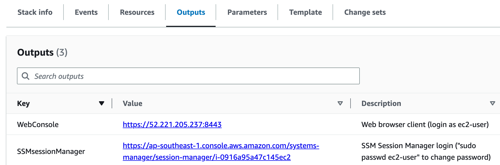
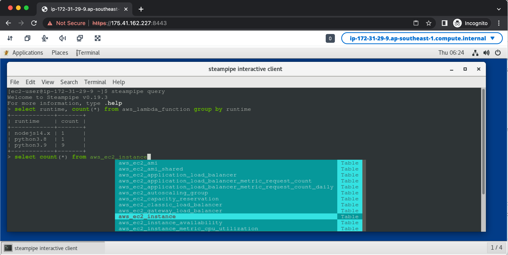

# EC2 Steampipe
[Steampipe](https://steampipe.io/) is an open source tool for querying cloud APIs using SQL. The AWS plugin maps AWS APIs to over 250 SQL tables that users can query separately or in combination to answer questions about their AWS environment compute, networking, and storage resources, check security posture, explore billing, and more.

The tool is mentioned on [AWS Open Source blog](https://aws.amazon.com/blogs/opensource/)
- [Querying AWS at scale across APIs, Regions, and accounts](https://aws.amazon.com/blogs/opensource/querying-aws-at-scale-across-apis-regions-and-accounts/)
- [Compliance auditing with Steampipe and SQL](https://aws.amazon.com/blogs/opensource/compliance-auditing-with-steampipe-and-sql/)
- [Dashboards as code: A new approach to visualizing AWS APIs](https://aws.amazon.com/blogs/opensource/dashboards-as-code-a-new-approach-to-visualizing-aws-apis/)

Installing and configuring steampipe requires effort and may raise security concerns as users must have [ReadOnlyAccess](https://docs.aws.amazon.com/aws-managed-policy/latest/reference/ReadOnlyAccess.html) IAM permission and Windows users must install Windows Subsystem for Linux (WSL 2.0).

This repo provides a CloudFormation template that provisions a EC2 instance running [Amazon Linux 2](https://aws.amazon.com/amazon-linux-2/) with Steampipe and AWS plugin installed and configured for immediate use. 

## Getting started
Download the [CloudFormation template](ec2-steampipe.yaml) and provision it in your AWS [CloudFormation console](https://console.aws.amazon.com/cloudformation). 
Once provisioned, go to Outputs section.

Open the `SSMSessionManager` link value (in the form `https://<REGION>.console.aws.amazon.com/systems-manager/session-manager/<InstanceID>`) in a new browser tab to open SSM Session Manager session. Use the command `sudo passwd ec2-user` to set login password. 

Open the `WebConsole` link value (in the form `https://<EC2 Public IP>:8443/`) to access web browser console and login as user `ec2-user` with the password that you have set. 
 

## Attribution
Steampipe [binary](https://steampipe.io/downloads), [AWS plugin](https://hub.steampipe.io/plugins/turbot/aws) and other binaries in the EC2 instance are downloaded without modification. Usage indicates acceptance of their licenses.

## Using Steampipe
Steampipe is installed with AWS plugin configured for the region where CloudFormation template is provisioned. From a terminal session, you can [query](https://steampipe.io/docs/query/overview) your AWS environment. You can run Steampipe in [service mode](https://steampipe.io/docs/managing/service) and use a Postgres-compatible database client such as [Sqlectron-gui](https://github.com/sqlectron/sqlectron-gui)) to issue queries.

Refer to [AWS plugin site](https://hub.steampipe.io/plugins/turbot/aws) for [table definitions and examples](https://hub.steampipe.io/plugins/turbot/aws/tables) and advanced configuration options such as [multi-region](https://hub.steampipe.io/plugins/turbot/aws#multi-region-connections) and [multi-account](https://hub.steampipe.io/plugins/turbot/aws#multi-account-connections) connections.

Refer to [Steampipe Hub mods site](https://hub.steampipe.io/mods?q=AWS) for mods that can perform [compliance auditing](https://aws.amazon.com/blogs/opensource/compliance-auditing-with-steampipe-and-sql/) and run [dashboards](https://aws.amazon.com/blogs/opensource/dashboards-as-code-a-new-approach-to-visualizing-aws-apis/) among other things. 

## Updating steampipe
To update steampipe and associated plugins, login to EC2 instance and run `/home/ec2-user/update-steampipe` script. 

## About remote web console
Remote web access is provided by [NICE DCV](https://aws.amazon.com/hpc/dcv/) server and supports [file transfer](https://docs.aws.amazon.com/dcv/latest/userguide/using-transfer-web.html). Usage indicates acceptance of [NICE DCV EULA](https://www.nice-dcv.com/eula.html).

Native clients can be downloaded from https://download.nice-dcv.com/

## Security

See [CONTRIBUTING](CONTRIBUTING.md#security-issue-notifications) for more information.

## License

This library is licensed under the MIT-0 License. See the LICENSE file.
